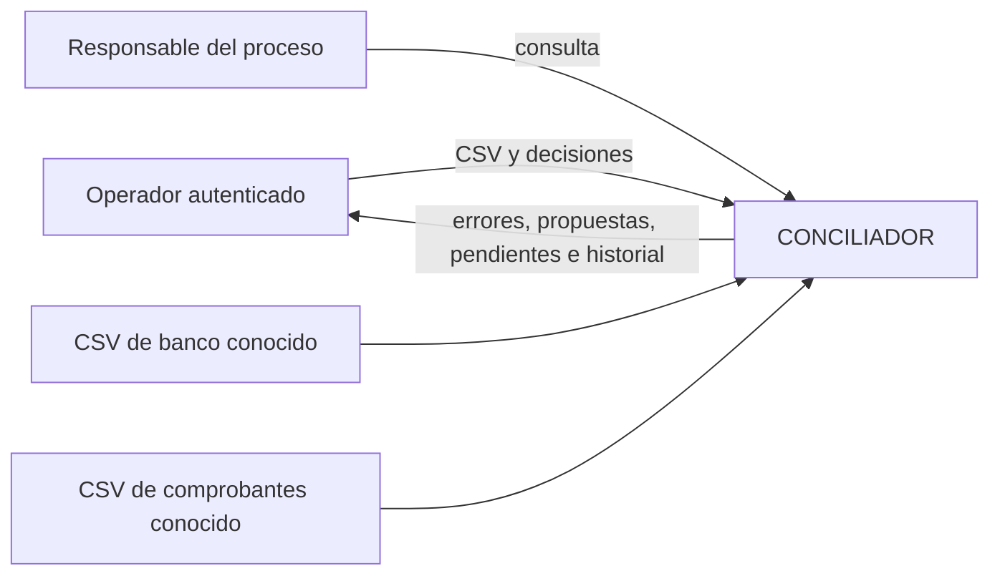
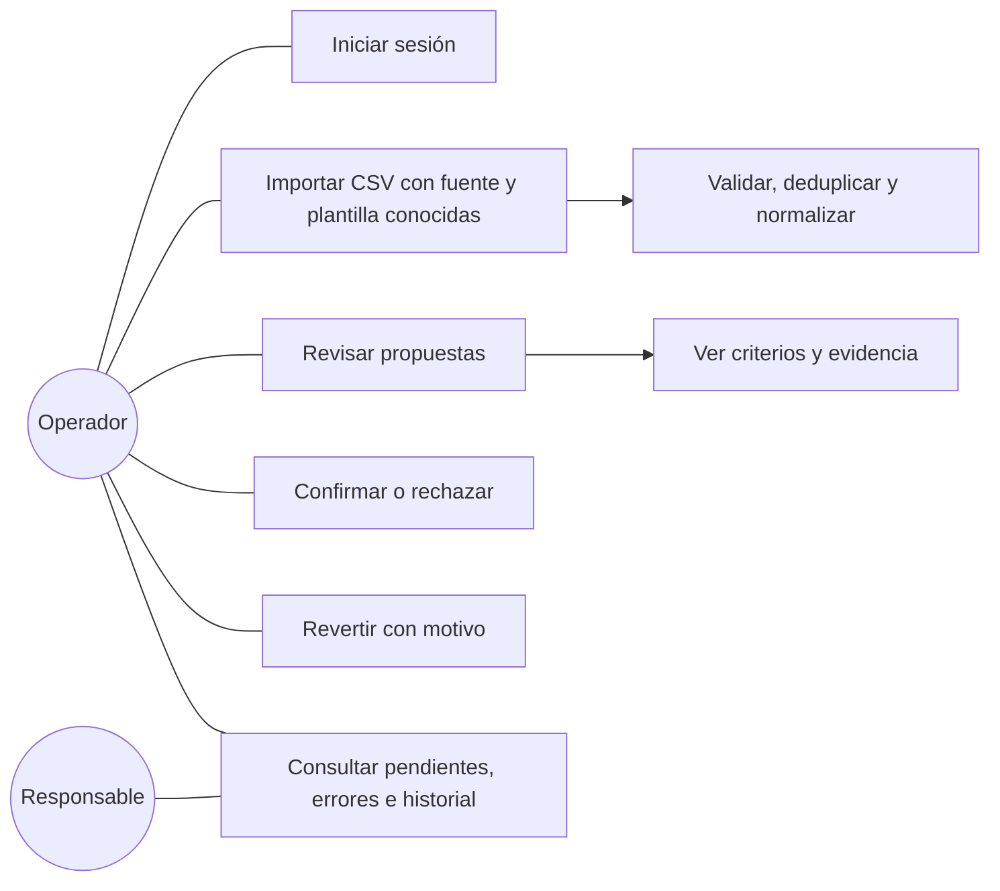
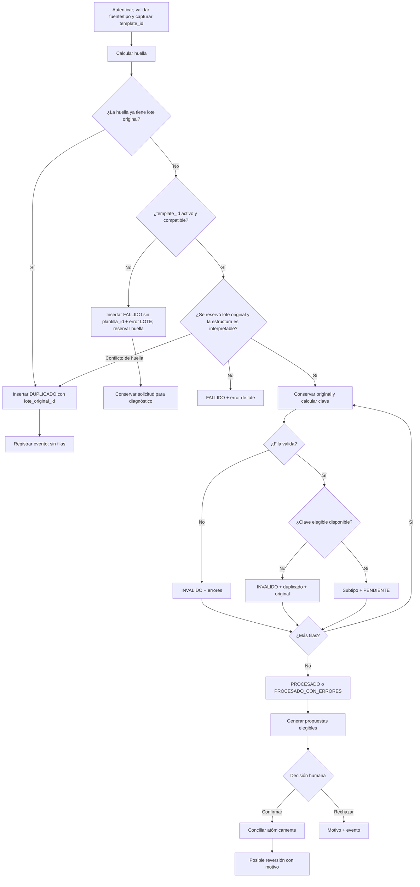
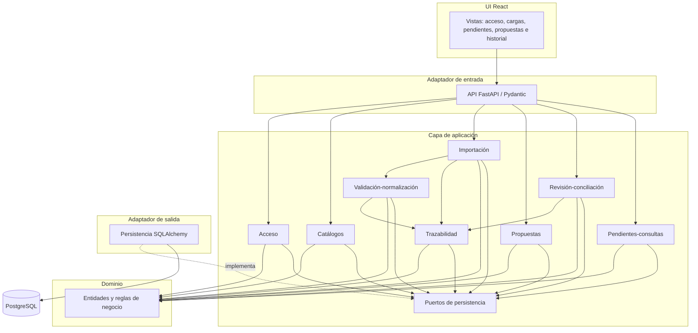
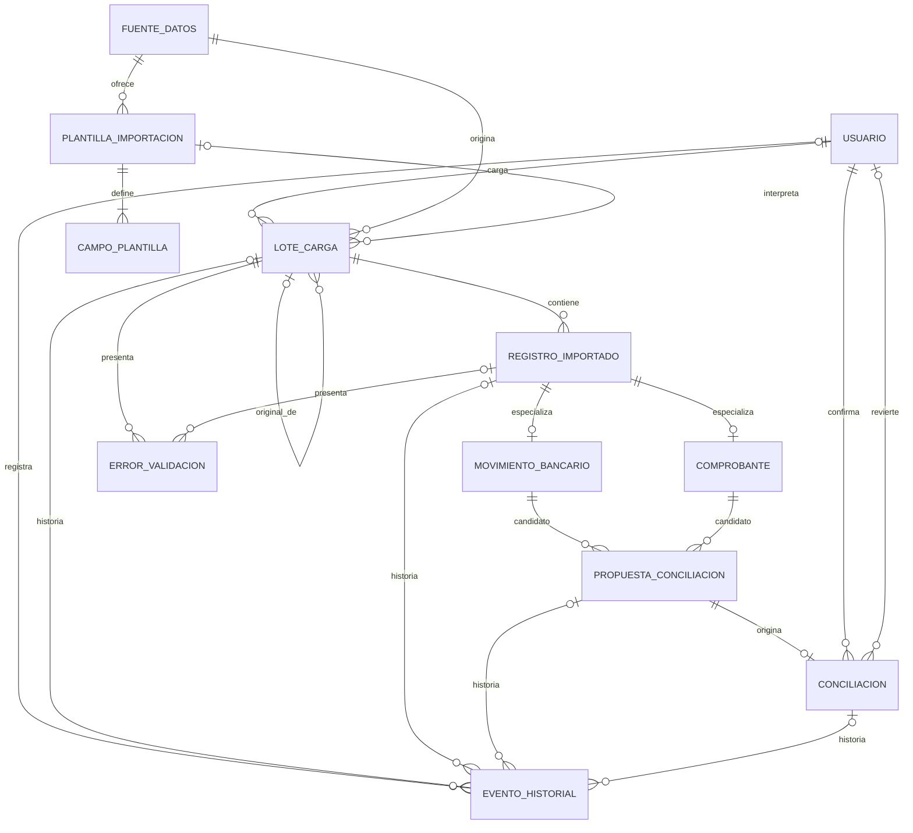
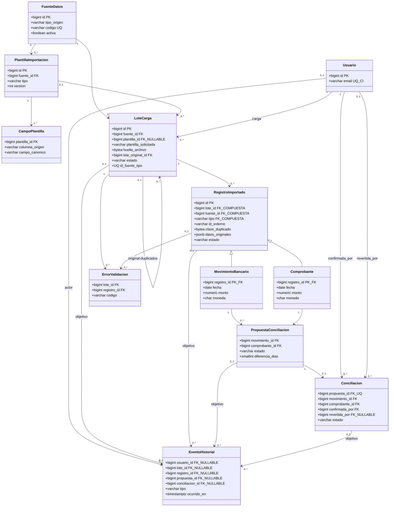
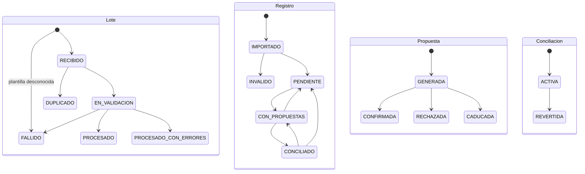

# Diagramas del diseño propuesto

Estos ocho diagramas son vistas complementarias. El [diccionario](05-diccionario-de-datos.md) gobierna restricciones que Mermaid simplifica. Las fuentes se integran aquí deliberadamente para ofrecer renderizado directo en GitHub y evitar ocho archivos `.mmd` redundantes, sin eliminar ningún diagrama previsto.

## 1. Contexto



## 2. Casos de uso



## 3. Actividad



## 4. Módulos



## 5. Entidad-relación



## 6. Modelo lógico



## 7. Estados



## 8. Secuencia

```mermaid
sequenceDiagram
 actor O as Operador
 participant API
 participant I as ServicioImportacion
 participant P as ServicioPropuestas
 participant R as ServicioRevision
 participant DB as PostgreSQL
 O->>API: cargar CSV(source_id, template_id, tipo)
 API->>I: importar bytes
 I->>I: calcular huella y conservar solicitud
  I->>DB: buscar reserva previa por fuente, tipo y huella
  alt archivo ya recibido
   I->>DB: INSERT DUPLICADO(original_id) + evento y COMMIT
   I-->>O: duplicado, sin registros
  else candidato a lote original
   I->>DB: resolver template_id exacto
   alt plantilla desconocida
    I->>DB: INSERT FALLIDO sin plantilla_id + error LOTE; reservar huella; COMMIT
    Note over I,DB: Si una carrera ya reservó la huella, insertar DUPLICADO del ganador
    I-->>O: fallo consultable o duplicado
   else plantilla conocida
    I->>DB: INSERT lote original ON CONFLICT y COMMIT intento
    alt conflicto concurrente de huella
     I->>DB: INSERT DUPLICADO(original_id) + evento y COMMIT
     I-->>O: duplicado, sin registros
    else lote original
   I->>DB: BEGIN procesamiento
   loop filas
    I->>DB: validar e INSERT elegible ON CONFLICT
    alt fila duplicada o inválida
     I->>DB: INSERT INVALIDO + error
    else fila elegible
     I->>DB: INSERT subtipo y estado PENDIENTE
    end
   end
   alt fallo inesperado
    I->>DB: ROLLBACK procesamiento
    I->>DB: transacción corta FALLIDO + error LOTE + evento y COMMIT
    else procesamiento completo
     I->>DB: finalizar lote + evento y COMMIT
     I->>P: lote procesado; generar automáticamente
     P->>DB: BEGIN y bloquear ambos registros por ID ascendente
     P->>DB: revalidar estados, conciliación activa y criterios
     alt cambió elegibilidad o hay conflicto
      P->>DB: ROLLBACK sin propuesta vigente
     else pareja aún elegible
      P->>DB: INSERT nueva GENERADA; trigger revalida; COMMIT
      Note over P,DB: Terminales históricas; rechazo solo se reevalúa si cambian datos o versión
      P-->>O: candidatas ordenadas por referencia
     end
    end
    end
   end
  end
 O->>API: confirmar propuesta
 API->>R: confirmar(usuario)
 R->>DB: BEGIN; leer IDs inmutables de la pareja sin lock
 R->>DB: bloquear ambos registros por ID ascendente
 R->>DB: bloquear propuesta y revalidar que siga GENERADA
 R->>DB: confirmar propuesta; insertar ACTIVA; trigger caduca incompatibles; evento
 alt conflicto o estado inválido
  DB-->>R: restricción/error
  R->>DB: ROLLBACK
  R-->>O: rechazo sin cambios parciales
 else éxito
  R->>DB: COMMIT
  R-->>O: conciliación activa
 end
```
